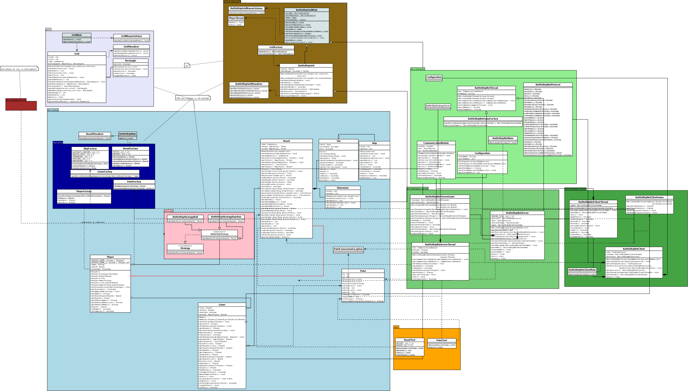

BattleShipGame
==============

Implementation of a game "BattleShip".

__To run a point-and-click game do__

$cd BattleShipGrid

$mr.bat

__To run a battle over the server do:__

$cd BattleShipNet

$start\_battle.bat

This starts one server, two clients, and arranges a BattleShip battle between clients.

__AI : adding BattleShip strategies__

To add a strategy extend BattleShipStrategy (for example see BattleShipStrategyRandom) and create a game (see GameFactory) with your strategy.

__Overview of the BattleShipGame__

